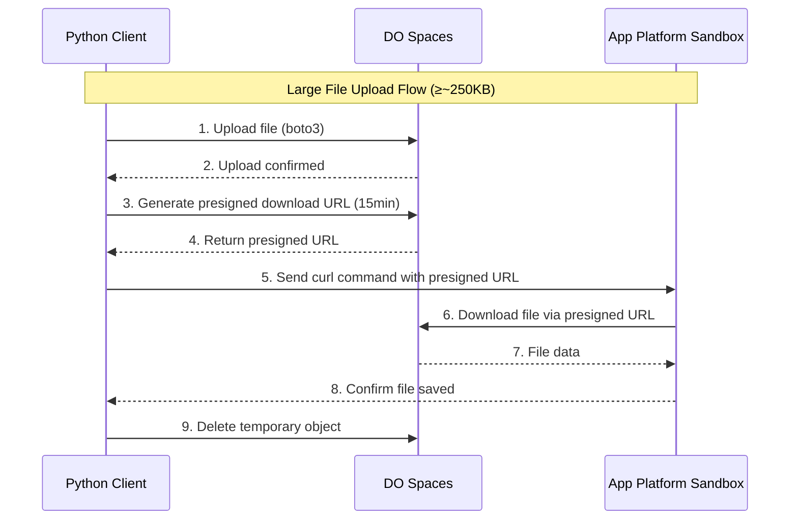
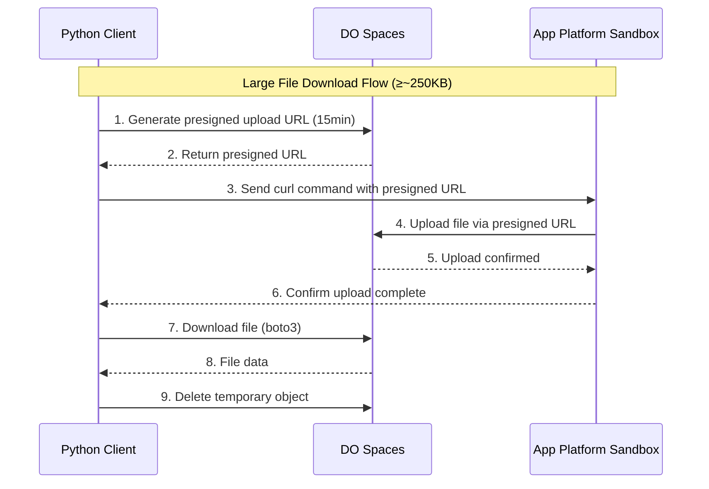

# Large File Transfers with Spaces

Transfer files larger than ~250KB efficiently using DigitalOcean Spaces as an intermediary. This architecture enables secure, fast transfers without exposing credentials to the sandbox. The threshold is configurable via `SANDBOX_LARGE_FILE_THRESHOLD`.

## Why Spaces Integration?

The standard file transfer methods use base64 encoding through the console connection, which works well for small files but becomes slow and unreliable for larger files. For files ~250KB or larger (default; configurable), we use DigitalOcean Spaces (S3-compatible object storage) as an intermediary:

- **Fast**: Direct HTTP transfers instead of console encoding
- **Secure**: Presigned URLs expire after 15 minutes (default; configurable)
- **Reliable**: Handles large files without timeout issues
- **No credentials in sandbox**: The sandbox never sees your Spaces credentials

## Architecture Overview

### Upload Flow (Local to Sandbox)



### Download Flow (Sandbox to Local)



## Configuration

### Required Environment Variables

Set these environment variables before using large file transfers:

```bash
export SPACES_ACCESS_KEY="your-spaces-access-key"
export SPACES_SECRET_KEY="your-spaces-secret-key"
export SPACES_BUCKET="your-bucket-name"
export SPACES_REGION="nyc3"  # or: sfo3, ams3, sgp1, fra1
```

### Optional Configuration

```bash
# Custom endpoint (if using a different Spaces region)
export SPACES_ENDPOINT="https://nyc3.digitaloceanspaces.com"

# Adjust the large file threshold (default: ~250KB)
export SANDBOX_LARGE_FILE_THRESHOLD="5242880"  # bytes
```

### Configuration via SpacesConfig

You can also pass configuration when creating a sandbox:

**Sync:**

```python
from app_platform_sandbox import Sandbox
from app_platform_sandbox.types import SpacesConfig

spaces_config = SpacesConfig(
    bucket="my-sandbox-bucket",
    region="nyc3",
    access_key="your-access-key",
    secret_key="your-secret-key"
)

sandbox = Sandbox.create(
    registry="your-registry-name",
    image="python",  # Required
    spaces_config=spaces_config
)
```

**Async:**

```python
sandbox = await AsyncSandbox.create(
    registry="your-registry-name",
    image="python",  # Required
    spaces_config={
        "bucket": "my-sandbox-bucket",
        "region": "nyc3",
        "access_key": "your-access-key",
        "secret_key": "your-secret-key"
    }
)
```

## Checking Spaces Availability

Before using large file methods, verify Spaces is configured:

```python
if sandbox.filesystem.has_spaces:
    print("Spaces is configured - large file transfers available")
else:
    print("Spaces not configured - only small files supported")
```

## Uploading Large Files

### Basic Upload

**Sync:**

```python
from app_platform_sandbox import Sandbox

sandbox = Sandbox.get_from_id(app_id="ml-sandbox-id")

# Upload a large file (e.g., ML model weights)
sandbox.filesystem.upload_large(
    local_path="./models/bert-large.bin",      # 1.3 GB file
    remote_path="/models/bert-large.bin"
)
print("Large file uploaded successfully")
```

**Async:**

```python
await sandbox.filesystem.upload_large(
    local_path="./datasets/training.parquet",
    remote_path="/data/training.parquet"
)
```

### With Progress Callback

Track upload progress for large files:

**Sync:**

```python
def progress_callback(bytes_transferred, total_bytes):
    percent = (bytes_transferred / total_bytes) * 100
    print(f"\rProgress: {percent:.1f}% ({bytes_transferred}/{total_bytes} bytes)", end="")

sandbox.filesystem.upload_large(
    local_path="./large_dataset.csv",
    remote_path="/data/dataset.csv",
    progress_callback=progress_callback
)
print("\nUpload complete!")
```

**Output:**

```
Progress: 100.0% (157286400/157286400 bytes)
Upload complete!
```

### Cleanup Control

By default, the temporary Spaces object is deleted after transfer. You can disable this:

```python
# Keep the Spaces object after transfer (for debugging)
sandbox.filesystem.upload_large(
    local_path="./model.bin",
    remote_path="/models/model.bin",
    cleanup=False  # Don't delete from Spaces
)
```

## Downloading Large Files

### Basic Download

**Sync:**

```python
# Download generated model or results
sandbox.filesystem.download_large(
    remote_path="/output/trained_model.bin",
    local_path="./results/trained_model.bin"
)
print("Model downloaded")
```

**Async:**

```python
await sandbox.filesystem.download_large(
    remote_path="/output/predictions.parquet",
    local_path="./results/predictions.parquet"
)
```

### With Progress Callback

```python
def download_progress(bytes_transferred, total_bytes):
    mb_done = bytes_transferred / (1024 * 1024)
    mb_total = total_bytes / (1024 * 1024)
    print(f"\rDownloading: {mb_done:.1f}/{mb_total:.1f} MB", end="")

sandbox.filesystem.download_large(
    remote_path="/models/fine_tuned.bin",
    local_path="./models/fine_tuned.bin",
    progress_callback=download_progress
)
print("\nDownload complete!")
```

## Examples

### Upload Large ML Model Files

```python
from app_platform_sandbox import Sandbox

sandbox = Sandbox.get_from_id(app_id="ml-inference-id")

# Upload pre-trained model (1.5 GB)
print("Uploading model weights...")
sandbox.filesystem.upload_large(
    local_path="./pretrained/llama-7b.bin",
    remote_path="/models/llama-7b.bin",
    progress_callback=lambda done, total: print(f"\r{done/1e9:.2f}/{total/1e9:.2f} GB", end="")
)
print("\nModel uploaded!")

# Upload tokenizer files
sandbox.filesystem.upload_file(
    local_path="./pretrained/tokenizer.json",
    remote_path="/models/tokenizer.json"
)

# Run inference
result = sandbox.exec(
    "python inference.py --model /models/llama-7b.bin",
    cwd="/app",
    timeout=600
)
print(result.stdout)
```

### Process Large Datasets

```python
from app_platform_sandbox import Sandbox

sandbox = Sandbox.get_from_id(app_id="data-processing-id")

# Upload large dataset (500 MB)
print("Uploading dataset...")
sandbox.filesystem.upload_large(
    local_path="./data/sales_2024.parquet",
    remote_path="/data/sales.parquet"
)

# Install dependencies and process
sandbox.exec("pip install pandas pyarrow")

sandbox.filesystem.write_file("/app/process.py", '''
import pandas as pd

# Load large dataset
print("Loading data...")
df = pd.read_parquet("/data/sales.parquet")
print(f"Loaded {len(df):,} rows")

# Process: aggregate by region
result = df.groupby("region").agg({
    "sales": "sum",
    "quantity": "sum",
    "customers": "nunique"
}).reset_index()

# Save results
result.to_parquet("/output/regional_summary.parquet")
print(f"Saved {len(result)} regional summaries")
''')

sandbox.filesystem.mkdir("/output")
result = sandbox.exec("python /app/process.py")
print(result.stdout)

# Download results
sandbox.filesystem.download_file(
    remote_path="/output/regional_summary.parquet",
    local_path="./results/regional_summary.parquet"
)
```

### Download Generated Outputs

```python
from app_platform_sandbox import Sandbox

sandbox = Sandbox.get_from_id(app_id="training-sandbox-id")

# Train model (creates large output files)
result = sandbox.exec(
    "python train.py --epochs 100 --save-path /output/model.pt",
    cwd="/app",
    timeout=3600  # 1 hour timeout for training
)
print(result.stdout)

# Download trained model (may be several GB)
print("Downloading trained model...")
sandbox.filesystem.download_large(
    remote_path="/output/model.pt",
    local_path="./trained_models/model.pt",
    progress_callback=lambda d, t: print(f"\r{d/1e6:.0f}/{t/1e6:.0f} MB", end="")
)
print("\nModel saved locally!")

# Download training logs (small file, use regular method)
sandbox.filesystem.download_file(
    remote_path="/output/training_log.json",
    local_path="./trained_models/training_log.json"
)
```

### Full ML Pipeline with Large Files

```python
from app_platform_sandbox import Sandbox
import json

def progress(done, total):
    pct = (done / total) * 100
    print(f"\r  Progress: {pct:.1f}%", end="")

# Connect to existing ML sandbox
sandbox = Sandbox.get_from_id(app_id="ml-pipeline-id")

# Step 1: Upload training data (200 MB)
print("Step 1: Uploading training data...")
sandbox.filesystem.upload_large(
    local_path="./data/train.parquet",
    remote_path="/pipeline/data/train.parquet",
    progress_callback=progress
)
print("\n  Done!")

# Step 2: Upload validation data (50 MB)
print("Step 2: Uploading validation data...")
sandbox.filesystem.upload_large(
    local_path="./data/val.parquet",
    remote_path="/pipeline/data/val.parquet",
    progress_callback=progress
)
print("\n  Done!")

# Step 3: Upload pre-trained weights (400 MB)
print("Step 3: Uploading pre-trained weights...")
sandbox.filesystem.upload_large(
    local_path="./models/pretrained.bin",
    remote_path="/pipeline/models/pretrained.bin",
    progress_callback=progress
)
print("\n  Done!")

# Step 4: Run training
print("Step 4: Running training...")
sandbox.exec("pip install torch pandas pyarrow")

result = sandbox.exec('''
python -c "
import torch
print('Training complete!')
print('Saving model to /pipeline/output/model.pt')
torch.save({'epoch': 100, 'accuracy': 0.95}, '/pipeline/output/model.pt')
"
''')
print(f"  {result.stdout.strip()}")

# Step 5: Download results
print("Step 5: Downloading trained model...")
sandbox.filesystem.mkdir("/pipeline/output")
sandbox.filesystem.download_large(
    remote_path="/pipeline/output/model.pt",
    local_path="./output/trained_model.pt",
    progress_callback=progress
)
print("\n  Done!")

print("\nPipeline complete!")
```

## Error Handling

```python
from app_platform_sandbox.exceptions import (
    SpacesNotConfiguredError,
    FileOperationError
)

try:
    sandbox.filesystem.upload_large(
        local_path="./large_file.bin",
        remote_path="/data/large_file.bin"
    )
except SpacesNotConfiguredError:
    print("Spaces is not configured!")
    print("Set SPACES_ACCESS_KEY, SPACES_SECRET_KEY, SPACES_BUCKET, SPACES_REGION")

except FileOperationError as e:
    print(f"Transfer failed: {e}")
```

### Fallback for Missing Spaces Configuration

```python
def upload_file_smart(sandbox, local_path, remote_path, size_threshold=5*1024*1024):
    """Upload using the appropriate method based on file size and Spaces availability."""
    import os
    file_size = os.path.getsize(local_path)

    if file_size >= size_threshold and sandbox.filesystem.has_spaces:
        print(f"Using Spaces for large file ({file_size/1e6:.1f} MB)")
        sandbox.filesystem.upload_large(local_path, remote_path)
    elif file_size >= size_threshold:
        print(f"Warning: Large file ({file_size/1e6:.1f} MB) without Spaces - may be slow")
        sandbox.filesystem.upload_file(local_path, remote_path)
    else:
        sandbox.filesystem.upload_file(local_path, remote_path)

# Usage
upload_file_smart(sandbox, "./model.bin", "/models/model.bin")
```

## Security Considerations

1. **Presigned URLs expire**: URLs are short-lived (default 15 minutes; configurable)
2. **No credentials in sandbox**: The sandbox only receives temporary URLs
3. **Automatic cleanup**: Temporary objects are deleted after transfer
4. **Bucket isolation**: Use a dedicated bucket for sandbox transfers

## Troubleshooting

### "Spaces not configured" Error

Ensure all required environment variables are set:

```bash
echo $SPACES_ACCESS_KEY    # Should show your access key
echo $SPACES_SECRET_KEY    # Should show your secret key
echo $SPACES_BUCKET        # Should show your bucket name
echo $SPACES_REGION        # Should show region (e.g., nyc3)
```

### Transfer Timeouts

For very large files, increase the command timeout:

```python
# For multi-GB files, allow more time for the curl command
sandbox.filesystem.upload_large(
    local_path="./huge_file.bin",
    remote_path="/data/huge_file.bin",
    progress_callback=lambda d, t: print(f"\r{d/1e9:.2f} GB", end="")
)
```

### Bucket Permissions

Ensure your Spaces credentials have read/write access to the bucket:

1. Go to DigitalOcean Control Panel → API → Spaces Keys
2. Create a key with full access to your bucket
3. Use those credentials in your environment

## Next Steps

- [File Operations](sandbox_fileops.md) - Standard file operations for smaller files
- [Background Processes](sandbox_processes.md) - Run long-running file processing jobs
- [Run Commands](sandbox_runcommands.md) - Execute commands on uploaded files
