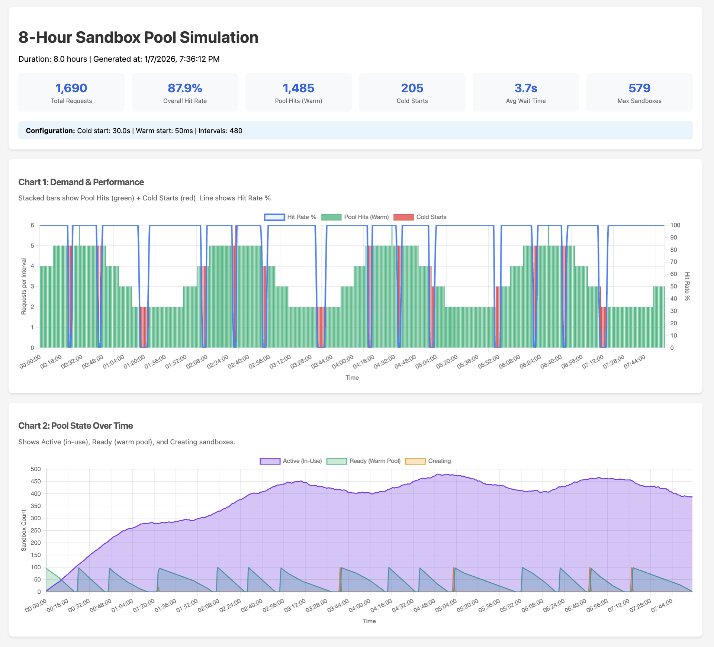

# Pool Simulator

A deterministic simulation framework for sizing sandbox pools and understanding cost/value tradeoffs.

## Quick Start

```bash
cd tests/modeling/pool_simulator && uv run python demand_curves.py
```

## Model Your Scenario

Edit the parameters in `demand_curves.py` (around line 1602):

```python
requests_per_minute = 4.0   # How many sandbox requests per minute?
min_hold_minutes = 5.0      # Shortest execution time (minutes)
max_hold_minutes = 15.0     # Longest execution time (minutes)
```

### Example Scenarios

| Scenario              | req/min | hold time   | Use case                    |
|-----------------------|---------|-------------|-----------------------------|
| AI inference          | 2       | 3-10 min    | ML model serving            |
| Code execution        | 5       | 5-15 min    | Interactive coding env      |
| Data processing       | 4       | 10-30 min   | ETL, batch jobs             |
| CI/CD builds          | 1       | 15-45 min   | Build & test pipelines      |
| Long-running jobs     | 0.5     | 30-120 min  | Heavy compute, training     |

## What You'll See

The simulator outputs:

1. **Pool Sizing** - Recommended `target_ready` for 95% hit rate
2. **Simulation Results** - Actual hit rate achieved
3. **Cost Summary** - Execution time vs pool overhead

Example output:
```
COST/USAGE SUMMARY
  211 sandbox executions completed
  Total execution time: 35.60 hours
  Pool Overhead: 40.98 hours
  Total Billable: 76.59 sandbox-hours
  Efficiency: 46.5%

To achieve 94% hit rate, you pay for:
  76.59 sandbox-hours
  (of which 35.60 hours is actual execution)
```

## Value Proposition

**~2x overhead is excellent value:**

| Without Pool | With Pool |
|-------------|-----------|
| 100% cold starts (30s wait) | 94% instant (50ms) |
| Unpredictable latency | Consistent, fast |
| Poor user experience | Production-ready |

You pay 2x execution cost → Get 600x faster response (30s → 50ms).

## Key Formula

```
concurrent_load = requests_per_minute × avg_hold_minutes
```

Example: 4 req/min × 10-min hold = 40 concurrent sandboxes needed.

## Overview

**App Platform sandboxes are for LONG-RUNNING workloads** (5+ minutes to hours). This is where App Platform excels vs serverless (which gets expensive at 5+ min).

The simulator models single-use disposable sandboxes:
- Each sandbox is held for a configurable duration (5 min - 4 hours by default)
- When released, the sandbox is destroyed (not returned to pool)
- Pool replenishment creates NEW sandboxes to maintain `target_ready`

**Cost: $0** - No real sandboxes are created. All simulation is algorithmic.

## Pool Sizing Calculator (Programmatic)

```python
from tests.modeling.pool_simulator.demand_curves import calculate_pool_config

config = calculate_pool_config(
    requests_per_minute=4.0,
    avg_hold_minutes=10.0,
    target_hit_rate=0.95,
)
print(f"target_ready={config.target_ready}")  # ~100 for this example
```

### Example Output



This generates:
- `tests/artifacts/simulation_chart.html` - Interactive visualization
- `tests/artifacts/simulation_log.csv` - Per-interval metrics
- `tests/artifacts/simulation_requests.csv` - Per-request lifecycle log

## Default Simulation Parameters

| Parameter | Value | Description |
|-----------|-------|-------------|
| Duration | 8 hours | Total simulation time |
| Interval | 1 minute | Metrics collection granularity |
| Request Rate | 2-6/min | Wave pattern (4 cycles over 8 hours) |
| Hold Time | 5 min - 4 hours | Random time each sandbox is held |
| Cold Start | 30 seconds | Time to create new sandbox |
| Warm Start | 50ms | Time to acquire from pool |
| target_ready | 100 | Warm pool buffer size |
| max_sandboxes | 600 | Maximum total sandboxes |

## Output Files

### simulation_chart.html

Interactive HTML with two charts:

**Chart 1: Demand & Performance**
- Stacked bars: Pool Hits (green) + Cold Starts (red)
- Line: Hit Rate % (right axis)

**Chart 2: Pool State**
- Active (in-use sandboxes)
- Ready (warm pool)
- Creating (being provisioned)

### simulation_log.csv

Per-interval metrics for time-series analysis:

```csv
time,time_seconds,requests,pool_hits,cold_starts,hit_rate_pct,active,ready,creating,total
00:00:00,0.0,4,4,0,100.0,4,96,0,100
00:01:00,60.0,4,4,0,100.0,8,92,0,100
...
```

### simulation_requests.csv

Per-request lifecycle for detailed analysis:

```csv
request_id,time,time_seconds,image,source,wait_ms,success,release_time,release_seconds,hold_duration_s
1,00:00:00,0.0,python,pool_hit,50.0,True,00:01:22,82.5,82.5
2,00:00:00,0.0,python,cold_start,30000.0,True,00:03:00,180.9,30.9
...
```

## Demand Curve Generators

The module provides several demand pattern generators:

```python
from tests.modeling.pool_simulator.demand_curves import (
    steady_load,      # Constant request rate
    sudden_spike,     # Baseline with sudden peak
    gradual_ramp,     # Linear increase/decrease
    wave_pattern,     # Sinusoidal (daily traffic)
    bursty,           # Periodic bursts
    random_bounded,   # Random within bounds
)
```

### Examples

```python
# Steady 5 requests per interval for 1 hour
curve = steady_load(requests_per_10s=5, duration_seconds=3600)

# Spike from 2 to 20 requests at 30 minutes
curve = sudden_spike(baseline=2, spike=20, spike_at=1800, spike_duration=300, total_duration=3600)

# Wave between 2-10 requests with 2-hour period
curve = wave_pattern(min_rps=2, max_rps=10, period_seconds=7200, duration_seconds=28800)
```

## Custom Simulations

```python
import asyncio
from tests.modeling.pool_simulator.demand_curves import (
    wave_pattern,
    run_simulation,
    generate_chart_html,
    export_csv,
    export_request_log,
    print_result,
)

async def custom_simulation():
    # Define demand pattern
    curve = wave_pattern(
        min_rps=2,
        max_rps=6,
        period_seconds=7200,
        duration_seconds=28800,
        interval=60.0,
    )

    # Run simulation
    result = await run_simulation(
        curve=curve,
        pool_config={"python": {"target_ready": 100, "max_sandboxes": 600}},
        max_total_sandboxes=600,
        cold_start_time_seconds=30.0,
        warm_start_time_seconds=0.05,
        min_hold_time_seconds=300.0,   # 5 minutes
        max_hold_time_seconds=14400.0, # 4 hours
        snapshot_interval=60.0,
    )

    # Output results
    print_result(result)
    generate_chart_html(result, "my_simulation.html")
    export_csv(result, "my_simulation_intervals.csv")
    export_request_log(result.events, "my_simulation_requests.csv")

asyncio.run(custom_simulation())
```

## Run Tests

```bash
# Run all simulator tests
uv run pytest tests/modeling/ -v

# Run just the demand curve tests
uv run pytest tests/modeling/pool_simulator/test_demand_curves.py -v
```

## Key Metrics

- **Hit Rate**: Percentage of requests served from warm pool (target: >85%)
- **Cold Starts**: Requests that waited 30s for new sandbox creation
- **Max Sandboxes**: Peak resource usage during simulation
- **Active**: Sandboxes currently in use
- **Ready**: Sandboxes available in warm pool
- **Creating**: Sandboxes being provisioned

## Tuning Guidelines

| Scenario | Recommendation |
|----------|----------------|
| Low hit rate (<80%) | Use `calculate_pool_config()` to compute correct `target_ready` |
| High cold starts | Increase `target_ready` - pool may be undersized for demand |
| Max sandboxes too high | Reduce `max_sandboxes` or shorten hold times |
| Hitting limits | Increase `max_sandboxes` to 1.5x `target_ready` |

**Use the Pool Sizing Calculator** for accurate recommendations:
```python
from tests.modeling.pool_simulator.demand_curves import calculate_pool_config
config = calculate_pool_config(requests_per_minute=4.0, avg_hold_minutes=10.0)
print(f"target_ready={config.target_ready}, max={config.max_sandboxes}")
```

## Architecture

```
demand_curves.py         - Curve generators, simulation engine, visualization
algorithmic_simulator.py - Mock SandboxManager with realistic pool behavior
```

The simulator uses time acceleration (1000x) to run 8-hour simulations in seconds while maintaining accurate pool dynamics.
